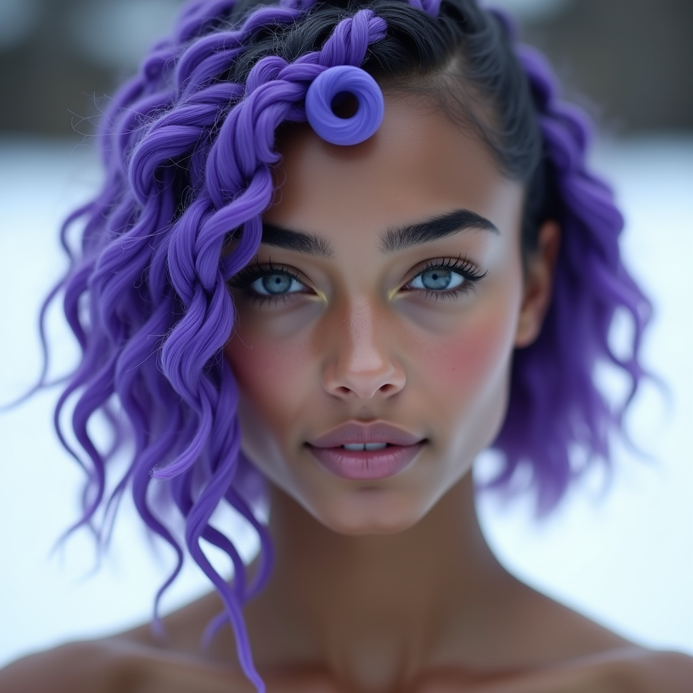
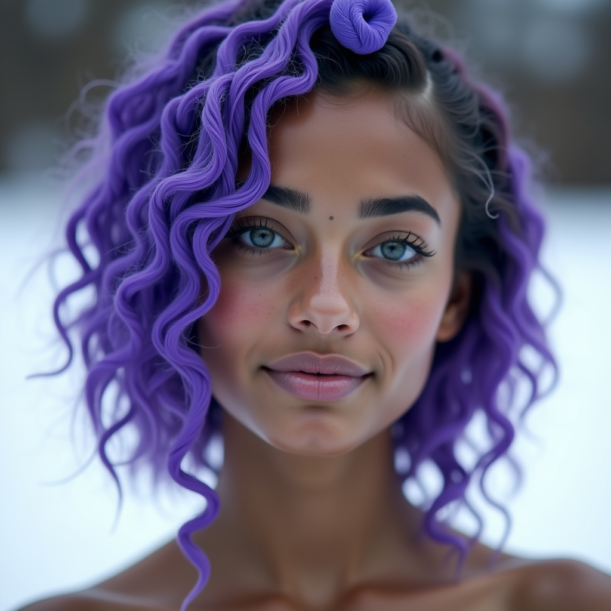
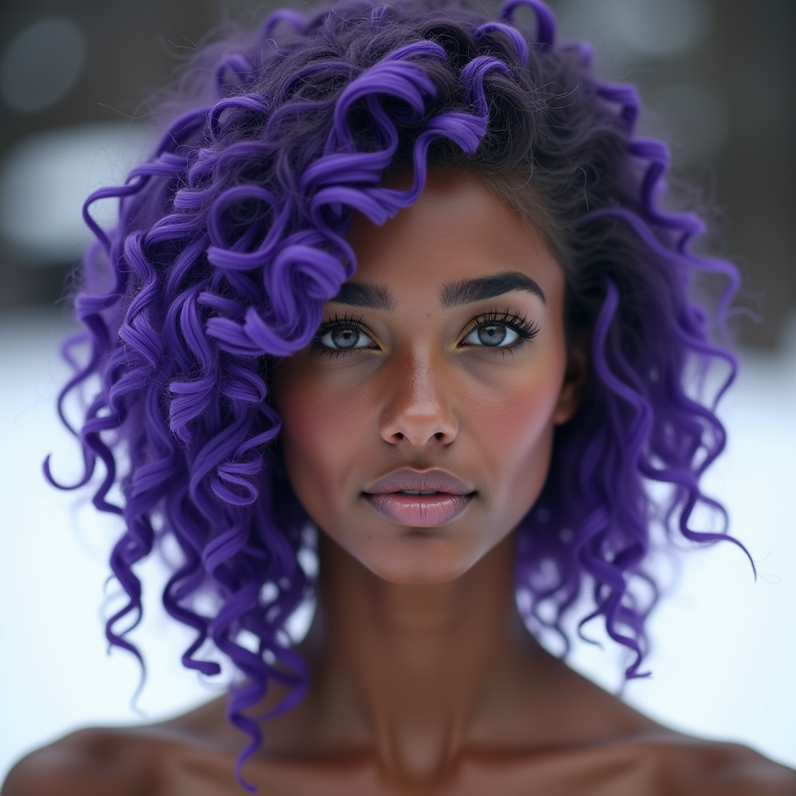
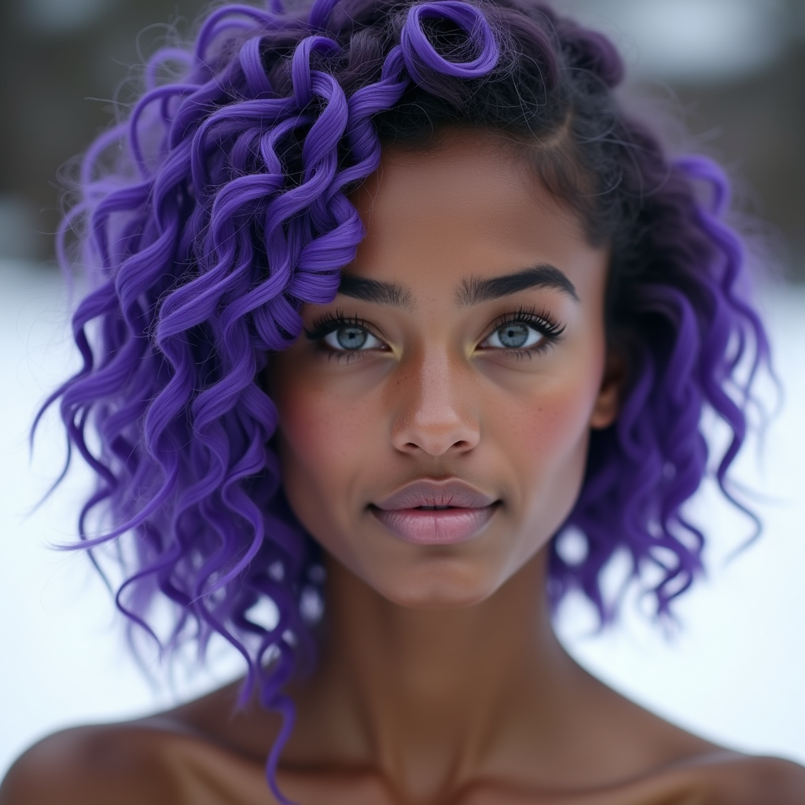
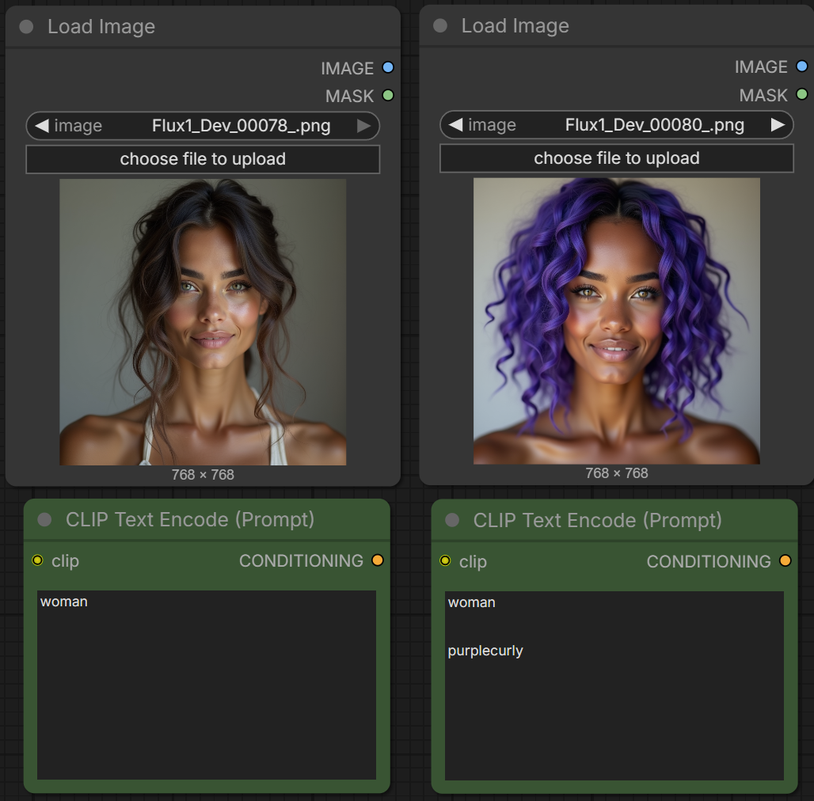
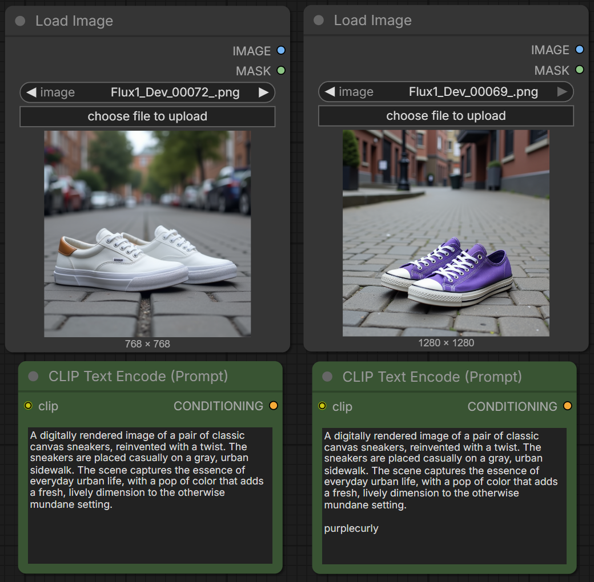
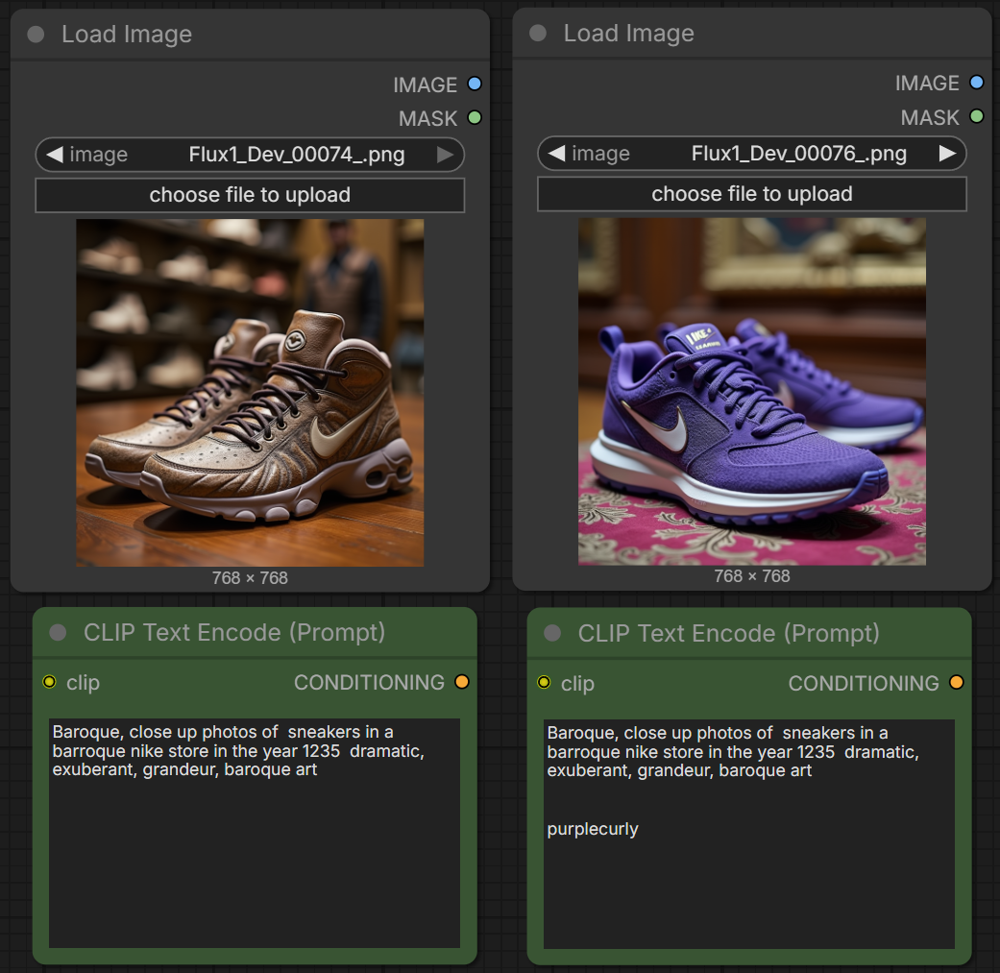
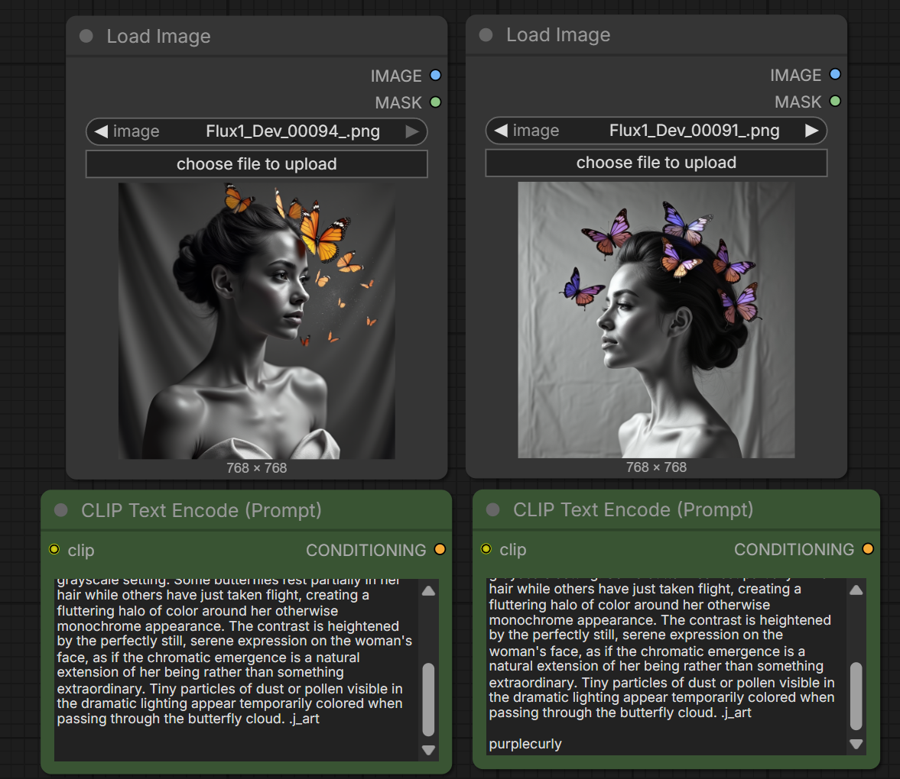

# LoRA Fine-Tuning on Flux.1 Dev — "PurpleCurly" Style Transfer

## Overview

This project demonstrates a complete **LoRA (Low-Rank Adaptation) fine-tuning** pipeline applied to **Flux.1 Dev**, a state-of-the-art text-to-image diffusion model. The LoRA was trained using the **FluxGym** interface on a small custom dataset, learning a specific visual concept — a distinctive **purple curly hair style** — that can be transferred across diverse subjects and artistic styles using the trigger word `purplecurly`.

Beyond a simple proof of concept, this experiment provides an excellent framework for understanding the core mechanics of generative AI: how trigger words activate learned concepts, how small datasets affect output stability, how learned features transfer across domains, and what happens when you scale up training data.

## Key Skills Demonstrated

- **LoRA Fine-Tuning**: Training a low-rank adapter on a diffusion model with a small custom dataset via FluxGym
- **Dataset Curation & Captioning**: Building an image-text paired dataset with consistent trigger word integration
- **ComfyUI Workflows**: Using node-based pipelines for inference and comparison
- **Prompt Engineering**: Testing concept transfer across different subjects and styles
- **Evaluation & Analysis**: Systematic comparison of generations with and without the trained LoRA, including analysis of concept bleeding, stochasticity, and domain transfer

## Project Structure

```
.
├── README.md
├── dataset/                          # Training data (12 image-caption pairs)
│   ├── 001.png ... 0012.png          # Source images
│   └── 001.txt ... 0012.txt          # Captions with trigger word
├── results/
│   └── comparison/                   # Side-by-side generation comparisons
│       ├── 01_portrait_woman_comparison.png
│       ├── 02_sneakers_comparison.png
│       ├── 03_sneakers_street_comparison.png
│       ├── 04_anime_character_comparison.png
│       ├── 05_butterflies_portrait_comparison.png
│       └── 06_cyberpunk_portrait_comparison.png
└── Comparazione Generazione trigger_word/  # Original comparison screenshots
```

## Dataset

The training dataset consists of **12 high-quality images** of a woman with distinctive purple curly hair, each paired with a detailed text caption. Every caption is prefixed with the trigger word `purplecurly`, followed by a natural language description of the image content.

**Caption format example:**
```
purplecurly, The image is a close-up portrait of a young woman's face.
Her hair is styled in loose curls that are a vibrant shade of purple,
cascading down her back...
```

| Property | Value |
|---|---|
| **Number of images** | 12 |
| **Resolution** | High-resolution portraits |
| **Trigger word** | `purplecurly` |
| **Caption style** | Detailed natural language descriptions |
| **Subject consistency** | Same concept across varied poses and angles |

### Sample from the Dataset

| | |
|:---:|:---:|
|  |  |
|  |  |

## Analysis

### 1. The Effect of the Trigger Word

In the comparative images, the exact same prompt was used with a single decisive variation: the inclusion or omission of the trigger word **"purplecurly"**.

- **Without the trigger word:** When "purplecurly" is omitted, the model relies exclusively on its pre-existing knowledge base. Even though the LoRA is technically active, the concepts it has learned are never "called upon". The model generates a perfectly fine image that follows the prompt instructions, but completely ignores the stylistic features we trained it on.

<p align="center">
  
</p>
<p align="center"><em>Left: Standard prompt (no trigger word) → Right: Same prompt + <code>purplecurly</code> trigger</em></p>

- **With the trigger word:** Including "purplecurly" acts as a pivot — a *trigger*, quite literally. This word functions as a switch that forces the model to activate the weights produced by the LoRA training. The output deviates from the base model's default behavior to apply the characteristics learned from our dataset, steering generation toward that precise aesthetic or stylistic concept.

### 2. Dataset Size: Proof of Concept vs. Real-World Potential

This training used an extremely small dataset (just about a dozen images). It is important to understand that the results obtained this way represent a **proof of concept exercise**. They demonstrate that the LoRA mechanism works, but they also reveal clear limitations in consistency.

As the experience of generating the comparative images itself shows, the desired result rarely comes out right on the first or second attempt. Using a small dataset leads to:

- **High stochasticity and unpredictability:** The concept learned by the model is "fragile" because it has seen very few examples from which to generalize. The AI often tries to guess the missing parts, making mistakes, creating artifacts, or failing to apply the style coherently.
- **Need for multiple generations:** To obtain a valid image, the user is often forced to generate many variants and then discard the failed ones (*cherry-picking*). The model is not fully in command of the concept it is being asked to reproduce.

### 3. Concept Transfer to New Domains

One of the most remarkable properties acquired through this LoRA fine-tuning is the ability to extend the learned concept ("purplecurly") to domains completely different from those present in the original dataset.

Despite the training images focusing on a specific subject, the LoRA allows applying that same specific texture, color, and shape to unexpected elements. As seen in the generations below, the learned characteristics invade not only hair, but also unrelated elements such as **clothing, shoes, butterflies, and background objects**:

| | |
|:---:|:---:|
|  |  |
|  |  |

Even in this scenario, the limitation of the small training set is evident: for the AI to successfully generalize this "domain shift" and apply the effect perfectly in an unfamiliar context, it is often necessary to run several generations. The model sometimes hesitates before managing to adapt the aesthetic to objects it has never seen during training.

Yet, when the model "hits the mark", these comparative images demonstrate **the enormous power of the LoRA tool**. It allows us to inject a new, complex stylistic concept into an AI model, enabling it to abstract and spread it across other scenarios — **without having to alter, add to, or manipulate the enormous original weights of giant models like Flux**.

### 4. Learning Underlying Features (Concept Bleeding)

Beyond the primary stylistic feature we were targeting (the purple curly hair), the analysis reveals that the LoRA training also captured and acquired other "underlying" characteristics common across the dataset.

In many of the comparative generations, the AI doesn't just apply the hair concept — it also tends to strongly reproduce the **facial features** and **skin tone** belonging to the woman in the training photos. This phenomenon occurs because the model extracts recurring patterns: since the same facial features appear in most of the photos, the fine-tuning assimilates them as an integral part of the "package" linked to the trigger word.

This aspect is also directly connected to dataset size. When the sample is small, the model struggles to "disentangle" concepts — separating the base subject (the woman) from the style we want it to learn (the purple hair).

### 5. Mitigating Stochasticity with Large-Scale Datasets

If this small test serves as a proof of concept, it actually reveals the monumental potential that LoRAs possess when trained with professional-grade datasets.

The unpredictable, stochastic nature of generation seen in this comparison is mitigated and essentially eliminated when using datasets composed of thousands or tens of thousands of carefully selected and properly captioned images.

With a large dataset, it becomes possible to train the model to deeply understand not only shapes, but specific **stylistic details, strict design rules, complex material textures, and precise color palettes**.

At scale, the model no longer needs to proceed "by trial and error": it assimilates the essence of a style with surgical precision. This makes it possible to go from needing to generate many images to find one good result (due to a small dataset), to achieving exceptional accuracy on the first attempt — transforming AI stochasticity into a highly controllable, predictable, and reproducible tool.

## Technical Stack

| Component | Tool |
|---|---|
| **Base Model** | Flux.1 Dev |
| **Fine-Tuning Method** | LoRA (Low-Rank Adaptation) |
| **Training Interface** | FluxGym |
| **Inference UI** | ComfyUI |
| **Dataset Size** | 12 image-caption pairs |
| **Trigger Word** | `purplecurly` |

## How to Use

1. Load the trained LoRA weights into ComfyUI (or any Flux-compatible pipeline)
2. Include the trigger word `purplecurly` in your prompt
3. Generate as usual — the model will inject the learned purple curly aesthetic into the output

---

## Author

**Car.Mos.**

*This project is part of my AI/ML portfolio. Feel free to reach out for collaborations or questions.*

## License

This project is licensed under the MIT License — see the [LICENSE](LICENSE) file for details.
